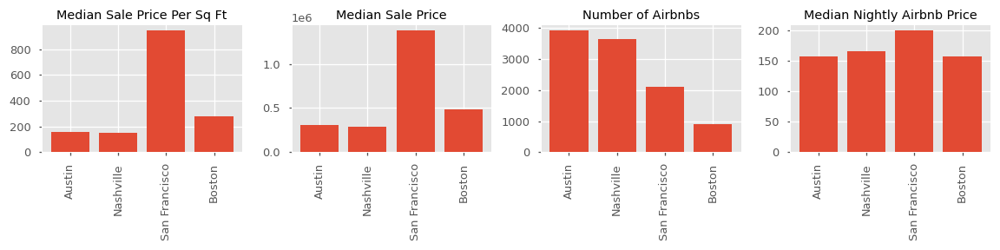
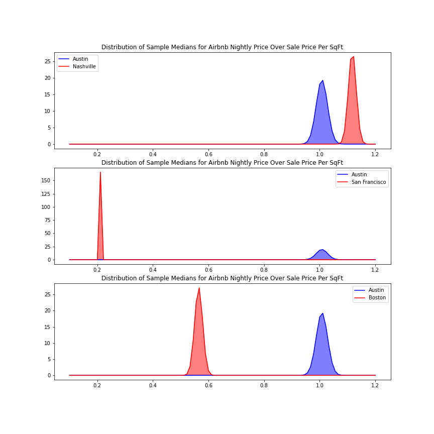
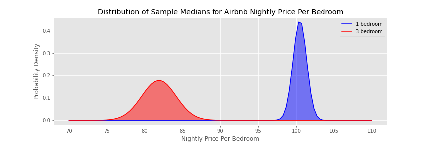
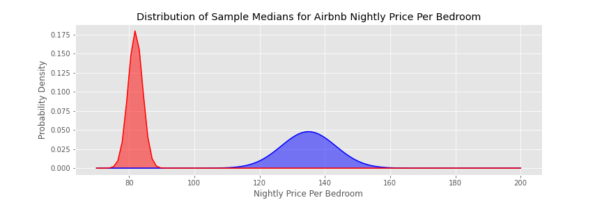
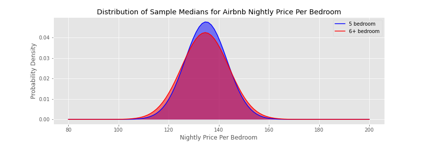
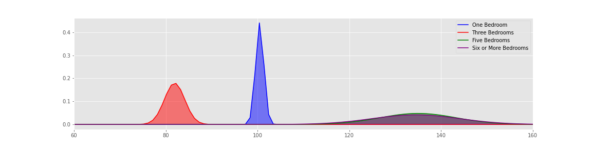
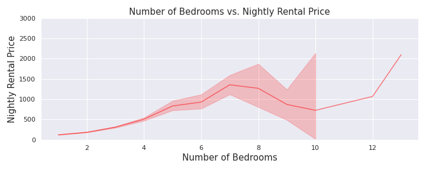
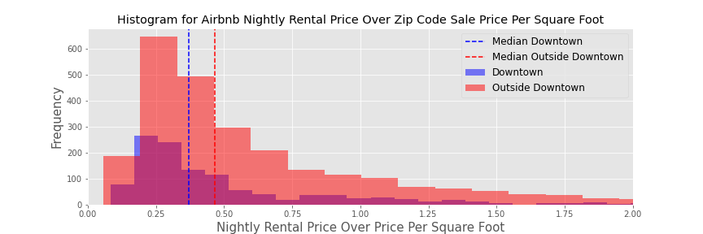
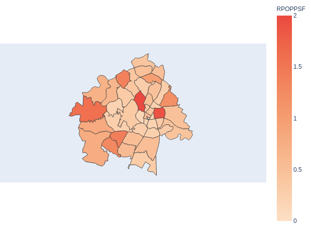

# Real Estate Investing Analysis - Buying an Airbnb in Austin

## Motivation:
I bought my first house in 2018.  What made buying the house doable, and profitable, was that there was a "casita" or back house in the backyard.  After buying the house in late October, I paid a friend to design it and buy furniture for it and I was able to put it on Airbnb by the end of December.  I didn't know it at the time, but this would lead me much further into real estate and Airbnb.  I have now owned or managed 5 listings on Airbnb in the San Antonio and Austin, TX area.  This has been a fun side gig but has also taught me a lot about real estate and made me some money as well.

Through this process, I have wondered how I would go about buying a rental property to put on Airbnb, and what would have the best Return on Investment.  There's a lot of considerations when thinking about real estate investing, especially when putting a property in the short-term rental space.  I wanted to explore three specific things that I would look at when buying an investment property to put onto Airbnb:

**1. City Location:**

It is no surprise that some cities do better on Airbnb than others.  While most cities now have properties listed on Airbnb now, some are huge tourist destinations and can command more money per night on a short-term rental, since the demand is so high.  Other cities are also new to the market and have very low supply, so they can also charge high rates.  Some markets, like San Antonio, are budget markets since people are coming to San Antonio to visit family or to get away for the weekend and don't look for really high-quality listings (however, San Antonio actually has a fairly high tourism rate and has a pretty consistent customer base for short term rentals).  I am seeking to compare the Austin market to several other cities to see how it compares.  I also want to normalize for the median price per square foot of sale prices in the cities so that I can have a better idea of real return on investment.

**2. House Size:**

House size can make a big difference in terms of return on investment.  One of the primary advantages of Airbnbs over hotel rooms is that they can house large numbers of people in the same location for a relatively low price per person.  So, obviously, you can charge more per night with a larger house with more bedrooms.  However, can you charge more per night per bedroom?  In other words, is the amount that you can charge per night a linear relationship with the amount of bedrooms in the house?  For example, if you can charge 100 USD per night for a 1 bedroom house, can you charge 300 USD per night for a 3 bedroom house or 500 USD per night for a 5 bedroom house, etc.?

**3. Area within the City:**

It also should come as no surprise that there are areas in the city that fair better for a short term rental than others.  The conventional wisdom is that a downtown Airbnb will always do better than an Airbnb that is not downtown, but is this the case?  Even if a downtown Airbnb makes more money than one that isn't downtown, can it offset the higher real estate cost?

## City Location
Austin is an incredibly fast growing city.  According to USA Today, it was the fourth fastest growing city in the United States between 2010 and 2018 (https://www.usatoday.com/story/money/2019/05/09/americas-fastest-growing-cities/39442201/).  Tourism is high and real estate prices have risen faster than a lot of places around the country.  So how does it compare to other cities?

To satisfy my curiosity, I wanted to compare with 3 other cities.  I chose a city on the East coast, the West coast and one that is more centrally located.  The three cities I chose were Boston, San Francisco and Nashville.  I did not have data on tourism rates but I was able to find the number of Airbnbs, average nightly price, and average sale price per square foot as of October 2020.  

Here's some baseline information about each city that sets the stage for the analysis:

To compare the four cities, I used data from redfin to find the median sale price per square foot of house sales in the metro areas of the four cities.  I divided the nightly rental price of each listing by the cities median sale price per square foot to take the into consideration the prices of the local real estate market.  I then used bootstrap sampling to find the median of the composite score (nightly rental price divided by the city's median sale price per square foot) for each listing.  

The bootstrap medians looked normally distributed, but the variance was not equal, so I used a Welch's t-test to see if we could show there was a statistical difference in the median composite scores for each city.  I ran a t-test for each city against Austin.  My null hypothesis for each test was that Austin was the same or worse in terms of composite score while my alternate hypothesis was that Austin was better in terms of the composite score mentioned earlier.

### Running bootstrap samples
Running the bootstrap samples on Austin vs. the other three cities yielded the following:

This chart shows the medians of the composite score for each city.  This may be a little confusing, but basically, the score of 1 for Austin means that the median of all the listings divided by the price per sqft of Austin (about 157 USD per square foot) is about one.  This also means the median Airbnb nightly rental price is about 157 USD.  This lines up with the earlier graphs comparing the cities.

We also see that while Nashville and Austin are pretty similar, but Nashville is higher.  These results led to investigating Austin vs. Nashville more closely.

#### Austin vs. Nashville Mann Whitney U test
I wanted to compare Austin and Nashville nightly rental prices.  The data is not normally distributed, so I used a Mann-Whitney U Test.  The null hypothesis was that Austin had the same nightly rental price as Nashville or less while the alternate hypothesis was that Nashville had a greater nightly rental price.

Performing a Mann Whitney U test, I obtained a p-value of 0.0589.  This is slightly too high to reject the null hypothesis at an alpha level of 0.05 so the test was inconclusive.

However, when running the test after dividing each rental price by the price per square foot, I obtained a p value of 3.17e-07.  On that basis, I can say that Nashville performs better using the metric I created to compare the cities.

## Number of Bedrooms
What size house should you invest in?  It is fairly obvious that the larger the house, the more bedrooms, and the more you can charge per night.  However, is it a linear relationship?  Will the nightly rate for a one bedroom house be one third the nightly rate of a three bedroom house?  Is there a sweet spot in terms of number of beds and rental price per bedroom?

NOTE: There was not data available on sale price per bedroom of the houses.  To truly compare the expenses of the house to the income per bedroom, you would need this data and would require further analysis.  For the sake of this project, I am looking only at rental price per bedroom.
NOTE2: From here on out, we will only be looking at Austin data.

To do this analysis, I made a metric for each listing which was nightly rental price divided by the number of bedrooms.  I then divided the data into separate dataframes based on the number of bedrooms in the listing.  The final step was to run bootstrap samples on the medians for the Nightly Rental Price over the Number of Bedrooms metric that I created earlier.  

Above, you can see that the median nightly price per bedroom for a single bedroom house is almost 20 USD higher than for a three bedroom house.  This is interesting and may require further analysis as to why, but I believe that there is a certain threshold below which people are not willing to list their properties.  This threshold would cause the one bedrooms to have a higher nightly price per bedroom.

I also compared three bedroom houses to five bedroom houses, as well as five bedroom houses to those with six or more bedrooms.

It was interesting to see how much greater of a nightly price per bedroom the five bedroom houses commanded over the three bedroom houses.  My guess is that there is a much smaller supply of five bedroom houses than there is for three bedroom houses, so you can charge higher nightly rates (per bedroom).

It can also be seen that there is no real difference in the medians for five bedroom houses and those with six or more bedrooms.

Putting these PDFs together on one graph is shown by the following:

This graph shows how the variability changes.  A one bedroom house will have a much less wide range of price than a five or six bedroom plus house.  

Putting the relationship of nightly price to bedrooms is shown in the graph below.  This also shows how variability increases with house size.

## Location in Austin
Location plays a big part in whether you can make money with a short-term rental investment property.  The conventional wisdom says that downtown is the best place to be.  But is it?  Tourism might be higher and you may be able to charge more per night, but can that offset higher property values?

In order to do this analysis, I needed to choose which zip codes were considered downtown.  After doing some research, I decided that 78701, 78702, 78703 and 78705 where the best zip codes to place in the "downtown" category.  Something interesting that I found was the **over 25%** of the Airbnb listings included were in these four zip codes.  

The next step was to get the sale price per square foot for each zip code.  In order to do this, I used the websteam propstream.com to manually take the price per square foot for each Austin zip code that was included in the dataset.  From there, I added the zip code price per square foot to each listing based on zip code and created a new column which was the Airbnb Nightly Rental Price divided by the Sale Price Per Square Foot of that zip code.  This was the primary column I used to compare zip codes. 

### Histograms

But first, I wanted to see if the downtown listings did, in fact, have higher nightly rental prices.  A histogram of the distribution of nightly rental prices of downtown versus outside of downtown is shown below:

The histogram shows that the median is higher for downtown listings.  To be sure that it was higher, I used another Mann Whitney U test and obtained a p value of 4.65e-09.  So downtown listings do have a stastically significant higher nightly rental price.

To take house prices into consideration, I created a histogram of the metric created earlier with nightly rental prices over sale price per square foot of the zip code the listing is in.  This histogram is shown below:

This histogram shows that when the price per square foot is taken into consideration, the medians are flipped and the houses outside of downtown actually perform better.  A Mann Whitney U test was performed on this metric as well and, indeed, the metric was stochastically higher for the listings outside of downtown than those that were inside downtown.  

### Best Zip Codes to Be In
If it is actually better to be outside of downtown than inside, what are the best zip codes to be in?  Using the same metric as before (Airbnb Nightly Rental Price divided by the Median Sale Price Per Square Foot of the Zip Code of the Listing), I created a map showing where the metric was the highest.  

The darker the color on this map, the higher the greater the nightly rental price over price per square foot metric.  The best zip codes in Austin from this map are 78731, 78723, and 78738.  78731 has a score of over 2.5, which means that a house in this zip code is expected to rent out for 2.5 times the median sale price per square foot of the area.  This can be compared to an average of 1 across the city of Austin.  

## Conclusions
In conclusion, to begin searching for a short term rental investment property, it would be best to look at a one bedroom house or a house that is five bedrooms or more (dependant on your budget).  The best place to begin your search would be in the zip codes of 78731, 78723 and 78738.  

A final note, this analysis is a good place to start.  More individualized data is needed to choose a particular investment property.

___

### Further Study
I would want to look at availability.  None of this analysis takes into consideration the percent of time that the listings are booked.  So, while the bigger listings may command a higher price, they may be booked less often and compromise total revenue.

I would like to look at correlations between house Airbnb prices and availability.  I think you could find a sweet spot in terms of house size, house price, location, Airbnb price, and availability to maximize revenue.

You could take this a step further and have a web app that takes in MLS data and recommends houses to buy based on expected ROI.

#### Biggest data missing
The biggest hurdle to this analysis was not knowing __individual__ home prices and price per square foot.  Since I only had aggregate data for each city, as well as no information about how house prices changed per bedroom, it was difficult to get a true individualized analysis on the houses.  This would serve as an initial step in the process of finding an Airbnb, but more analysis would be required. 

#### Data Source(s): 
Websites and/or databases:
https://www.redfin.com/news/data-center/
http://insideairbnb.com/get-the-data.html
https://www.propstream.com/

#### Data Quality:
- In order to remove listings that are outliers - don't get booked or priced too highly to be competitive - **require at least 5 reviews**
    - _This cut down almost half of the listings in Austin!!_
    - There were still remaining outliers - most or all of them seemed to be by a company named WanderJaunt who has 433 listings around the country.  They had a number of listings that looked like they were moved up to 9,999 USD per night.  I am guessing that this is the maximum price per night allowed on the platform.  I am not sure why they are moved up so much - whether they are booked on a different platform or they do not want bookings, but they have days blocked off and they have reviews which is misleading.  **I also took these out of the data.**
- Also, this only includes listings that are entire home/apt... Listings that are a private room, shared room, or hotel room are not considered.
    
______

listings2 df:
- Had to use unzip to get data
- used regular expressions to extract bathrooms from text

Cleaning.py:
- This is used to clean the incoming Airbnb data for each city.  Since I had already done it for Austin, this was easy to reproduce for the other 13 cities.

**NOTE: AUSppsf obtained manually and not all information is completely up to date.  Some zip codes have the most recent info from March.**
- data obtained from propstream.com
____

